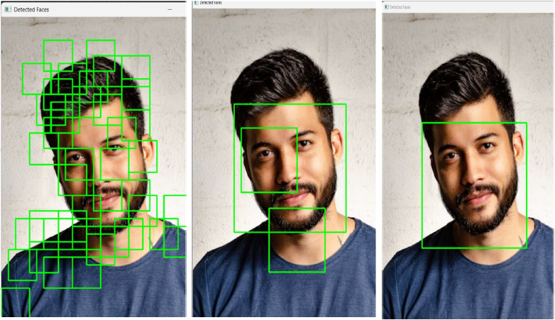
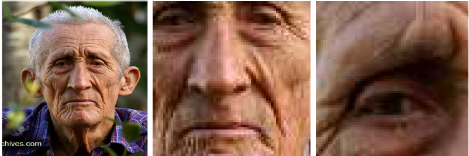
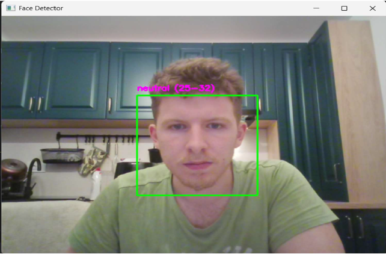

# Detecția facială, aproximarea emoției și a vârstei

## Autor: Dan Cristian Beldea, 332AA

## An: III


## 1)Introducrere:

În epoca modernă, odată cu dezvoltarea mediei sociale, a platformelor de socializare, folosite
azi ca prime tactici de marketing al produselor și serviciilor, se observă din ce în ce mai mult
dorința de a păstra relevanța; de a avea site-uri care rămân în ton cu preferințele consumatorului
de conținut și chiar cu starea acestuia. Utilizatorii doresc, în continuare, experiențe unice și
personalizate, astfel încât, atunci când intră pe platforma lor preferată de socializare, conținutul
care le este oferit să fie în concordanță chiar cu emoțiile lor, sau cu vârsta. De asemenea, în
simularea unui univers artificial de comunicație (ca de exemplu: Metaverse), dorim să ne putem
exprima cât mai ușor, în timp ce păstrăm anonimicitatea prin intermediul unui avatar.
Într-un astfel de peisaj, dominat de dorința pentru adaptabilitate, tema aleasă, și anume detecția
facială însoțită de aproximarea emoției și/sau a vârstei, devine o unealtă aproape esențială
pentru a păstra relevanța și conexiunea cu utilizatorul ale mediului virtual.

Ne propunem, prin acest proiect, să creăm o rețea neuronală convoluțională[1] antrenată să
detecteze și să extragă crop-uri ale fețelor pe un live video-feed, prin camera laptopului. Ne
propunem, de asemenea ca modelul să fie suficient de precis încât să poată funcționa practic.
Apoi, folosind imaginile extrase de rețeaua proprie, dorim să adăugăm modele performante
pentru aflarea emoției (Deepface) și a intervalului de vârstă (OpenCV). Pentru exemplificarea
modului de funcționare, vrem să adăugăm și dreptunghiuri/ pătrate în jurul fețelor detectate,
deasupra cărora să scrie emoția și vârsta, totul afișat pe o fereastră care se deschide la rularea
programului, pe ecran.

Față de proiectele similare deja existente, printre care am menționat și mai sus, sau ale căror
bucăți de resurse le folosim deja în alcătuirea proiectului nostru, modelul aduce la un loc toate
aceste tehnologii (combinația de detecție a fețelor cu CNN, apoi emoția și vârsta), face
procesarea în timp real pe flux video (cu optimizări multi-threading și batch detection), are
caracter modular, astfel putând fi foarte ușor integrat cu alte tehnologii de aproximare a gen-
ului sau etniei, etc.

## 2)Prezentare suport tehnic și realizări similare

În realizarea proiectului nostru, am beneficiat de progresele tehnologice recente din domeniul
rețelelor neuronale convoluționale (CNN), al procesării imaginilor și al analizei faciale
automate. Această secțiune va prezenta pe scurt suportul tehnic utilizat, câteva proiecte similare
și unele aspecte teoretice relevante din domeniul multimedia.

## 2.1 Suport tehnic utilizat

Pentru dezvoltarea sistemului nostru de detecție facială, am folosit:
- TensorFlow/Keras pentru implementarea rețelei neuronale convoluționale, capabilă să
detecteze fețele dintr-un flux video în timp real.
- OpenCV pentru lucrul cu fluxul de imagini de la camera laptopului, procesare și afișare
grafică a rezultatelor.
- DeepFace [2] ca soluție integrată pentru determinarea emoțiilor și a vârstei
utilizatorilorilor, bazată pe modele avansate pre-antrenate.


```
- Threading pentru separarea procesului de captare a imaginilor și cel de procesare,
asigurând fluiditatea fluxului video.
- Batch detection pentru eficientizarea pe multiple regiuni de interes simultan, reducând
astfel timpul de răspuns.
```
## 2.2 Realizări similare și comparație

În literatura de specialitate, am găsit numeroase abordări relevante:
- În lucrarea [1], Taigman și colaboratorii propun DeepFace, un model CNN capabil să
atingă performanțe comparabile cu recunoașterea facială umană. Punctul forte este
precizia foarte ridicată, însă soluția este greoaie pentru procesare în timp real pe
echipamente fără GPU puternic.
- În lucrarea [2], Schroff și colaboratorii introduc FaceNet, o abordare care folosește
embedding-uri pentru fețe, facilitând nu doar recunoașterea, ci și clustering-ul facial.
Deși foarte precis, FaceNet necesită resurse considerabile și nu adresează direct
problemele de analiză a emoțiilor sau vârstei.
- În lucrarea [3], Viola și Jones descriu un sistem de detectare rapidă de obiecte bazat pe
clasificatori Haar. Această metodă clasică este extrem de rapidă și eficientă pe
procesoare CPU, însă este sensibilă la variații de lumină și poziționare, ceea ce reduce
precizia în condiții reale complexe.
- Biblioteca DeepFace [2] oferă o integrare facilă a recunoașterii faciale, analizei de
emoții și a estimării vârstei. Punctul slab al acesteia este dimensiunea modelelor
încărcate, care poate duce la întârzieri semnificative în procesare, mai ales când este
folosită direct pe fluxuri video live.

Față de aceste soluții existente, proiectul nostru aduce un avantaj prin:
- Integrarea modulară a unui model propriu de detecție CNN cu tehnologii existente
de analiză facială;
- Optimizarea timpului de procesare prin batch detection și threading;
- Accesibilitatea pe echipamente uzuale, fără necesitatea unor resurse hardware
deosebite;
- Extensibilitatea pentru alte tipuri de predicții (gen, etnie) fără modificări majore ale arhitecturii.

## 2.3 Aspecte teoretice multimedia

Fluxul de date utilizat în proiect presupune capturarea de imagini video în format digital, care
sunt procesate în timp real. Din punct de vedere tehnic, avem:
- Reprezentarea imaginii: imaginile sunt captate în format RGB, fiecare pixel fiind
reprezentat de trei valori (roșu, verde, albastru) pe 8 biți.
- Compresia imaginilor: în timpul fluxului live nu se aplică compresie suplimentară,
însă OpenCV permite salvarea frame-urilor în formate comprimate (ex: JPEG) dacă
este necesar. În ceea ce privește antrenarea, imaginile din setul de date sunt salvate sub
format .PNG, pentru a asigura claritate maximă a suportului de învățare.


```
- Compresia video: nu este necesară în contextul afișării live, dar codec-uri ca H.264 ar
putea fi folosite pentru înregistrare.
- Watermarking și steganografie: deși nu sunt utilizate explicit în proiect, metodele de
protecție a conținutului multimedia își pot găsi cu ușurință locul, în viitor, pentru
protecția identității utilizatorilor sau a datelor transmise.
```
## 3)Prezentare tehnică a etapei de implementare

Proiectul a fost dezvoltat folosind o combinație de biblioteci și framework-uri specializate
pentru procesare de imagini, învățare automată și deep learning, toate adaptate pentru rularea
în timp real pe fluxuri video live.

## 3.1 Biblioteci, API-uri și Framework-uri utilizate

```
- TensorFlow/Keras: utilizate pentru crearea și antrenarea rețelei neuronale
convoluționale pentru detectia fețelor, pe un set de date compus din aproximativ 40.
de poze.
- OpenCV: pentru accesarea camerei web, manipularea imaginilor și desenarea
elementelor grafice pe ecran (dreptunghiurile din jurul fețelor, etichetele cu emoții și
vârstă).
- DeepFace: pentru analiza emoției dominante, folosind modele pre-antrenate
recunoscute în domeniul analizei faciale.
- OpenCV DNN Module: folosit pentru estimarea vârstei utilizatorilor printr-un model
CNN antrenat separat, implementat în format Caffe.
- Threading (biblioteca standard Python): folosit pentru separarea procesului de captură
video fata de partea de procesare a datelor (detecție facială), pentru a evita îngreunarea
(lag-ul).
```
## 3.2 Algoritm și metodologie

Am antrenat o rețea neuronală convoluțională cu 12 straturi (hidden) ascunse pentru a detecta
fețe la diverse scale în imagini date sub format (64 x 64 x 3, format RGB). Pentru antrenarea
acestui model am folosit un set de date alcătuit de mine din unirea mai multor seturi de date cu
fețe umane de pe Kaggle sau poze căutate pe Google Images. Setul de date este compus din
două foldere (reprezentând cele două clase: ”faces” și ”nonfaces”). Folderele conțin poze, pe
care le-am trecut printr-un algoritm de filtrare, folosind Haar Cascade ca sa încadrez strict fețe
de persoane și nu părți inutile din fundal. De asemenea le-am redimensionat la 64x64 cum am
menționat mai sus.

Câteva poze (aproximativ 5%) au fost puse de așa natură încât capul persoanei se află la
marginea imaginii, sau ușor întors din profil, dar trăsăturile (ambii ochi, gura, nasul) sunt toate
vizibile; asta ajutând la detecția fețelor care nu se află chiar în centrul ecranului.
Folderul care nu conține fețe, inițial, a avut doar imagini cu obiecte sau animale (flori, pisici,
caini, biciclete, mașini). De notat este că erau prezente și lucruri care pot semăna cu fețe umane
dar nu sunt.


Pentru găsirea fețelor pe imagine, am implementat un algoritm de tip ”sliding window” care ia
un cadru din video, apoi plimbă un chenar de-a lungul imaginii la diverse scale, verificând
pentru fiecare cea mai bună potrivire. La final se păstrează doar locul unde algoritmul a
considerat că în chenar există o față crop-ată.
La o primă rulare de test a modelului de detecție facială, rezultatele nu au fost mulțumitoare.
Aveam multe pătrate pe o multitudine de trăsături ale feței, uneori chiar și pe diverse obiecte
din background. Fața nu era văzută ca o față cu totul, ci ca o multitudine de fețe, modelul
recunoscând mai mult ochi, bărbie, ureche, etc. (vedeți Fig.1.)

Figura 1


Pentru a corecta acest aspect, am extins setul de ”nonfaces” cu mai multe poze ale obiectelor
pe care am observat că era fixat să le recunoască ca fețe (tastaturi, etichete, afișe colorate,
prize). Apoi, pentru a evita detecția de părți ale fețelor, am creat un program, care extrage din
setul de date inițial (cel cu poze nerestrânse cu oameni, unde se văd și fețe dar și background),
doar bucăți de genul: un pic de păr dar și background, un pic din bărbie, doar ochiul, doar gura,
etc, folosind încă odată Haar Cascade de la Opencv. (vedeți Fig.2.).

Figura 2.

```
a)poza originală b)față extrasă din poză^ c)poză pentru ”nonfaces”^
```

De asemenea, pentru a reduce si mai mult efectul de recunoaștere a diverselor trăsături, fapt
care ducea la câteva detecții in interiorul altor detecții, am implementat un algoritm care
păstrează doar cel mai mare contur, atunci când există contur in contur. (Non-Maximum
Supression)

După ce fețele au fost detectate, programul face snip doar pe conținutul chenarelor folosind
coordonatele x1, y1, x2, y2 ale dreptunghiurilor, le redimensionează la 224x224 trecându-le
prin modelul Deepface pentru detecția emoției, apoi prin OpenCV pentru vârstă. In final, iteram
prin lista cu fețe găsite și atribuim fiecărui set de coordonate, emoția și vârsta corespunzătoare,
afișându-le deasupra chenarelor corespunzătoare.

Putem, astfel, trage concluzia ca modelele folosite sunt 3 la număr: rețeaua convolutionala
creată de noi, deepface emotion recognition model si opencv age estimation.
Modelul nostru functionează, după cum am precizat mai devreme, prin trecerea imaginilor
printr-o serie de 12 straturi ascunse, pe care le voi explica pe scurt, după înțelegerea proprie.
De notat este că universul deep learning-ului este unul greu de cuprins în totalitate și nici măcar
oamenii de specialitate nu înțeleg în proporție de 100% totul despre rețelele cu care lucrează.

Straturile și scurtă prezentare a ceea ce fac:

1. Conv2D(32 filtre, kernel 3x3) + ReLU:
    - Detectează trăsături simple: linii, margini, colțuri în imagine.
    - Folosește 32 de filtre de 3x3 pixeli fiecare.
2. BatchNormalization:
    - Normalizează activările (mean 0, standard deviation 1).
    - Ajută la antrenare mai stabilă și mai rapidă.
    - Reduce riscul de overfitting.
3. MaxPooling2D(2x2):
    - Reduce rezoluția la jumătate (downsampling).
    - Păstrează doar cele mai puternice semnale.
    - Reduce dimensiunea și face modelul mai rapid.
4. Conv2D(64 filtre, kernel 3x3) + ReLU: Detectează pattern-uri mai complexe: colțuri
duble, combinații de margini.
5. BatchNormalization: Normalizează din nou activările pentru stabilitate.
6. MaxPooling2D(2x2): Din nou, reduce dimensiunea imaginii.
7. Conv2D(128 filtre, kernel 3x3) + ReLU: Detectează forme și structuri și mai complexe:
poate începe să vadă bucăți de ochi, gură, nas.


8. BatchNormalization: Stabilizează activările.
9. MaxPooling2D(2x2): Downsampling final la rezoluție foarte mică (extrage doar cele mai
importante feature-uri).
10. Flatten(): Transformă feature map-ul 2D (matricea) într-un vector 1D ca să îl putem da la
Fully Connected Layers.
11. Dense(256 neuroni) + ReLU:
    - Fully Connected Layer.
    - Învață să combine toate feature-urile detectate și să ia o decizie despre „față” sau „nu
       față”.
12. Dropout(0.5):
    - Random oprește 50% dintre neuroni la antrenare.
    - Previne overfitting-ul (adică să învețe pe de rost imaginile din antrenament).
13. Dense(1 neuron) + Sigmoid:
    - Neuron de output.
    - Întoarce un număr între 0 și 1 — probabilitatea că fereastra încadrată conține o față.

Modelul DeepFace pentru emotion detection analizează expresia facială dintr-o imagine pentru
a clasifica emoția unei persoane. El detectează fața, apoi o procesează printr-o rețea
convoluțională antrenată să recunoască expresii precum: angry, disgust, fear, happy, sad,
surprise, neutral. Modelul folosește caracteristici vizuale (cum ar fi forma gurii, ochilor,
sprâncenelor) pentru a prezice emoția dominantă. Acesta este aplicat doar pe regiunea feței —
de aceea l-am folosit pe crop-urile extrase de modelul nostru de detecție facială. Rezultatul este
o etichetă de emoție și un scor de încredere.

Modelul de estimare a vârstei din OpenCV folosește o rețea neuronală convoluțională antrenată
să recunoască intervale de vârstă pe baza trăsăturilor faciale. Acesta primește ca input o
imagine a feței, pe care o redimensionează și normalizează, apoi o procesează printr-un model
pre-antrenat (în format Caffe). Modelul nu returnează o vârstă exactă, ci alege cel mai probabil
interval dintr-un set fix de clase, precum 0-2, 8-12, 25-32, 38-43, etc. Alegerea se face pe baza
distribuției de probabilitate obținute la ieșirea rețelei. Astfel, modelul clasifică fața într-o
categorie de vârstă estimativă, oferind un rezultat interpretabil vizual și ușor de integrat.

## 3.3 Aspecte semnificative legate de Aplicațiile

## Multimedia

Proiectul atinge aspecte esențiale de procesare multimedia:
- Capturarea imaginii în timp real și manipularea acesteia frame-by-frame.


```
- Reducerea dimensiunii imaginilor (resizing la 64x64 pentru CNN și 224x224 pentru
DeepFace), afectând direct cantitatea de informație procesată.
- Analiza conținutului imagistic prin clasificare (emoții) și regresie (estimarea
vârstei).
- Compresia video implicită în fluxul capturat, chiar dacă nu se salvează fișiere,
imaginea este intern comprimată pentru transmisie.
```
## 3.4 Contribuție personală

Contribuția proprie a constat în:
- Antrenarea rețelei neuronale CNN pentru detecția facială folosind un set de imagini
propriu preprocesat.
- Implementarea sliding window multi-scale și optimizarea procesării prin batch
detection.
- Configurarea threadingului pentru separarea taskurilor de captare și procesare a
imaginilor.
- Integrarea DeepFace și OpenCV DNN pentru extinderea funcționalităților
sistemului fără afectarea performanței timpului real.
- Realizarea codului complet de procesare și afișare (inclusiv tratamente de excepții
pentru erori în predicție).
Astfel, lucrarea nu s-a limitat la utilizarea simplă a unor API-uri externe, ci a implicat o
personalizare profundă a întregului flux de procesare imagini și integrare multimedia

## 4)Interfață, utilizare și conținutul proiectului

Proiectul este alcătuit din următoarele fișiere:
-face_detector_model.py care conține logica din spatele rețelei convoluționale pentru
detecția de fețe (layerele, dropout-ul de 0.5, algoritmul de optimizare folosit fiind ”Adam” și
funcții le de activare ”relu” și ”sigmoid”). Structura rețelei neuronale convoluționale urmează
principiile descrise în lucrarea [6], folosind straturi succesive de convoluție, normalizare și
pooling pentru extragerea caracteristicilor și dense layers pentru clasificarea binară.
-train_face_detector.py care se ocupă de antrenarea modelului și salvarea lui sub
denumirea face_detector_model.h
-liveEmotionAndAge_detection.py constituind aplicația propriu-zisă, ce contopește
toate funcționalitățile și afișează output-ul camerei împreună cu adăugările A.I.-ului
-testDetection.py care este pur și simplu un fișier ajutător de debugging pentru
testarea modelului pe o singură poză.
-generate_face_patches.py se ocupă de generarea fețelor crop-ate ca etapă de
preprocesare a datelor raw luate de pe Kaggle.
-generate_face_parts.py care preia pozele și generează doar bucăți de fețe cum am
menționat anterior pentru a preveni detecția eronată a unor părți doar din față.
-age_deploy.prototxt și age_net.caffemodel care sunt documente necesare pentru
predicția de vârstă


În principiu, pentru a rula, aplicația nu are nevoie decât de fișierele menționate mai sus
(age_deploy.prototxt și age_net.caffemodel) , de liveEmotionAndAge_detection.py și de
modelul antrenat face_detector_model.h5 în același folder, pentru a rula corect.
Pe partea de ”user-friendly interface”, programul nu are un wrapper de genul .exe pentru a
putea fi rulat direct de pe desktop, dar, odată rulat în compiler, este destul de intuitivă
funcționalitatea sa. Se deschide o fereastră care ne arată output-ul de la camera disponibilă a
device-ului pe care ne aflăm. Programul se poate opri, închizând fereastra de la butonul ”X”
din dreapta-sus, sau apăsând tasta ”q”. Imediat ce programul detectează fețe, le încercuiește și
arată datele despre fețele surprinse pe ecran, ca in Figura 3.

Figura 3.


## 5)Concluzii și parametri de performanță

Pentru evaluarea performanței modelului de detecție facială creat de noi (deoarece evaluarea
celui de vârstă sau emoție este irelevantă), am folosit un alt model A.I. recunoscut pentru
precizie si acuratețe (MTCNN). Am alcătuit un folder cu aproximativ 400 de poze cu fețe și
fără fețe. Punem cele două modele să detecteze fețele din toate pozele respective. Considerăm
detecția făcută de modelul MTCNN cea reală și corectă, deși chiar și acest model, am putut
observa experimental că nu este infailibil. La fiecare poză, avem o serie de criterii care decid
cum clasificăm performanța curentă a modelului nostru:
- True Positive(TP), dacă centrul chenarului detectat de modelul nostru este în interiorul
chenarului detectat de MTCNN, și dimensiunile chenarelor sunt oarecum comparabile
- True Negative(TN), dacă ambele modele detectează fix 0 fețe în poză
- False Positive(FP), dacă numărul de fețe detectate de modelul nostru este mai mare
decât numărul de fețe descoperite de modelul importat
- False Negative(FN) dacă numărul de fețe detectate de modelul nostru este mai mic
decât numărul de fețe găsite de MTCNN.

Acuratețea o printăm la final cu formula cunoscută (A= (TN+TP)/total)


În urma verificărilor realizate asupra întregului batch de poze de testare, salvăm toate detecțiile
făcute de modelul nostru într-un folder și pe cele făcute de MTCNN în alt folder pentru un
potențial debugging vizual.

Acuratețea obținută nu este una extraordinară (cea mai bună obținută fiind de 65%), dintr-un
număr de motive:
- Modelul necesită extrem de mult timp pentru antrenare (aproximativ 35 de minute per
antrenare), ceea ce limitează posibilitatea de a ne juca cu valorile (gen numărul de
layere, funcțiile de activare, pozele din setul de date). Procesul este per total extrem de
time-consuming, astfel că nu am reușit să îl aduc la un stadiu ce poate fi scos în
producție. El este pur academic.
- Nici algoritmul MTCNN cu care am comparat algoritmul meu si pe care l-am considerat
corect si real, nu este atat de corect. De multe ori detecteaza fețe acolo unde nu sunt,
sau nu detecteaza fete deloc
- Încercând să realizez un model performant, am alcătuit un set de date puțin prea mare
pentru performanța computer-ului meu, și modelul pe măsură, având 12 straturi este
puțin prea beefy. O abordare mai inteligentă ar fi fost rezumarea la un model cu mai
puține straturi și cu mai puține date de antrenare, dar bine configurat.

Acestea fiind spuse, cu suficientă răbdare și un calculator cu un GPU performant (dedicat, nu
integrat), modelul are potențialul de ajunge la acuratețe mare, în urma găsirii configurării
corecte.

Prin realizarea acestui proiect am aprofundat concepte esențiale din domeniul Inteligenței Artificiale și Deep Learning-ului, în special în zona rețelelor neuronale convoluționale (CNN) și a integrării modelelor pre-antrenate în aplicații reale. Am dobândit experiență practică în procesarea imaginilor în timp real, manipularea datelor video frame-by-frame și prelucrarea matricelor de pixeli în formate digitale (RGB), în contextul construirii unui sistem de analiză facială bazat pe modele A.I. De asemenea, am înțeles rolul tehnicilor de preprocesare precum resizing, normalizare și batch processing în optimizarea performanței modelelor și a fluxurilor de inferență. Utilizarea threading-ului pentru separarea capturii video de etapa de inferență a consolidat înțelegerea arhitecturilor eficiente pentru aplicații interactive bazate pe A.I. Integrarea modelelor DeepFace și OpenCV DNN a oferit o perspectivă practică asupra modului în care sistemele de Deep Learning pot fi combinate pentru a rezolva probleme complexe precum detecția facială, recunoașterea emoțiilor și estimarea vârstei. Astfel, proiectul a contribuit semnificativ la dezvoltarea unor competențe solide în domeniul A.I., aplicabile în proiectarea și implementarea sistemelor inteligente moderne.

## 6)Bibliografie:

[1] Krizhevsky, A., Sutskever, I., Hinton, G.E. (2012). ImageNet Classification with Deep
Convolutional Neural Networks. In: Advances in Neural Information Processing Systems
(NeurIPS), pp. 1097–1105.

[2] Taigman, Y., Yang, M., Ranzato, M., Wolf, L. (2014). DeepFace: Closing the Gap to
Human-Level Performance in Face Verification. In: IEEE Conference on Computer Vision and
Pattern Recognition (CVPR), pp. 1701–1708.

[3] Schroff, F., Kalenichenko, D., Philbin, J. (2015). FaceNet: A Unified Embedding for Face
Recognition and Clustering. In: IEEE Conference on Computer Vision and Pattern Recognition
(CVPR), pp. 815–823.

[4] Viola, P., Jones, M. (2001). Rapid Object Detection using a Boosted Cascade of Simple
Features. In: IEEE Conference on Computer Vision and Pattern Recognition (CVPR), pp. 511-
518.

[5] Serengil, S.I., Ozpinar, A. (2020). DeepFace: Lightweight Face Recognition and Facial
Attribute Analysis Framework for Python. GitHub repository,
https://github.com/serengil/deepface (Accesat Aprilie 2025).

[6] Goodfellow, I., Bengio, Y., Courville, A. (2016). Deep Learning. MIT Press, ISBN 978-
0262035613


